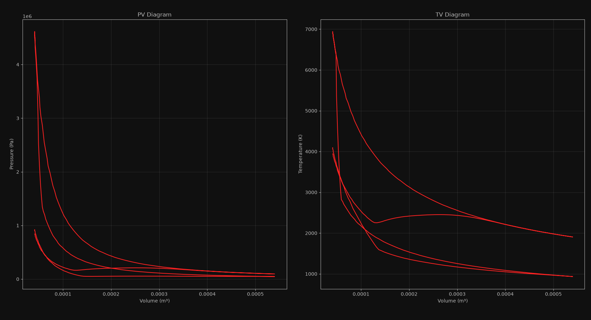
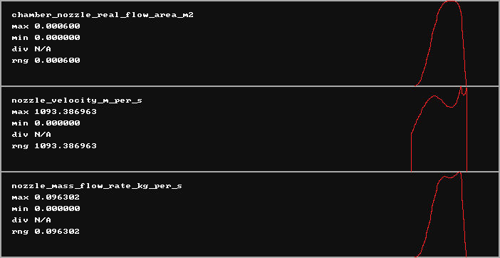

<video controls style="width: 100%; height: auto; margin-bottom: 30px;">
    <source src="video.mp4" type="video/mp4">
</video>

We are an independent research and development team based in Vancouver, BC,
on a mission to model realistic, real-time, internal combustion
engine audio for use in the games industry.

Our latest `ENSIM` alpha uses custom built proprietary, cache-friendly, single-threaded
numerical SIMD solvers to compute - in real-time with a 240 Hz controller input rate -
isentropic mass flow rates, combustion chamber thermodynamics, piston kinematics,
and computational fluid dynamics.

`ENSIM` approximates the standard C₈H₁₈ 14.7:1 air-fuel combustion process using a hypothetical
gas with a molar mass of 0.0023 kg/mol and a heat-capacity ratio of 1.5. This gas model produces
extremely high combustion temperatures, reaching well into the hypothetical 7000 K range to
generate intense, harmonically rich pulse trains guided by quintic cam-profile polynomials.

