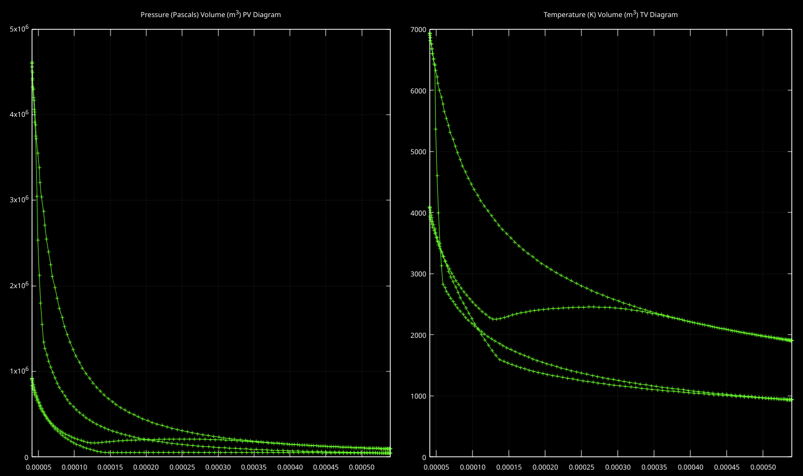

We are an independent research and development team based in Vancouver, BC,
on a mission to model realistic, real-time, internal combustion
engine audio for use in the games industry.

<video controls style="width: 100%; height: auto; margin-bottom: 10px;">
    <source src="video.mp4" type="video/mp4">
</video>

Our latest `ENSIM5` alpha uses custom built proprietary, cache-friendly, single-threaded SIMD
numerical solvers to compute - in real-time with a 240 Hz controller input rate -
isentropic mass flow rates, combustion chamber thermodynamics, piston kinematics,
and computational fluid dynamics.

